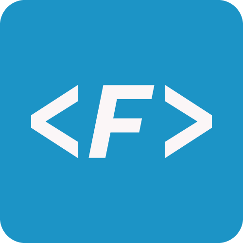

# ProgrammingFonts

### If you have a try of another kind of programming font,maybe you can have a new different feeling of coding which will make you feel fabulous,so just have a try!

#### Official website:

[http://www.programmingfonts.com](http://www.programmingfonts.com)

#### Github

[https://github.com/ProgrammingFonts/ProgrammingFonts](https://github.com/ProgrammingFonts/ProgrammingFonts)

#### What's this?

This is only a collection of programming fonts,just share this with the programmers.

#### Copyright Declaration:

All the fonts are from the internet.If I have copyright infringement,please tell me to remove the fonts.

#### The following fonts are here:

1.Source Code Pro

| Information         | Description
| ------------------- | -----------
| Designer(s)         | [Paul D. Hunt](http://www.adobe.com/products/type/font-designers/paul-hunt.html)
| Foundry             | [Adobe Systems](http://www.adobe.com/)
| Date created        | 2012
| License             | [SIL Open Font License](https://en.wikipedia.org/wiki/SIL_Open_Font_License)

Sample:

Source Code Pro/Extra Light/16:

2.Courier New

| Information         | Description
| ------------------- | -----------
| Classification      | [Slab serif](https://en.wikipedia.org/wiki/Slab_serif)
| Designer(s)         | [Adrian Frutiger](https://en.wikipedia.org/wiki/Adrian_Frutiger)
| Foundry             | [IBM](http://www.ibm.com)
| Date created        | 6 November 2009

Sample:

Courier New/Regular/16:

3.Andale Mono

| Information         | Description
| ------------------- | -----------
| Designer(s)         | [Steve Matteson](https://en.wikipedia.org/wiki/Steve_Matteson)
| Foundry             | [Monotype Imaging, Inc.](https://en.wikipedia.org/wiki/Monotype_Corporation)
| Date created        | 1993

Sample:

Andale Mono/Regular/16:

4.Monaco

| Information         | Description
| ------------------- | -----------
| Designer(s)         | [Susan Kare](https://en.wikipedia.org/wiki/Susan_Kare) [Kris Holmes](https://en.wikipedia.org/wiki/Kris_Holmes)
| Foundry             | [Apple Inc.](http://www.apple.com/)
| Date created        | Unknown
Replaced by Menlo in 2009.

Sample:

Monaco/Regular/16:

5.Monofur

| Information         | Description
| ------------------- | -----------
| Designer(s)         | Tobias Benjamin Köhler
| Date created        | Unknown

Sample:

Monofur/Regular/16:

6.Proggy

| Information         | Description
| ------------------- | -----------
| Designer(s)         | Tristan Grimmer
| Official Site       | [http://www.upperbounds.net/](http://www.upperbounds.net/)

ProggyCleanTT/Regular/16:

7.Droid Sans Mono

| Information         | Description
| ------------------- | -----------
| Designer(s)         | [Steve Matteson](https://en.wikipedia.org/wiki/Steve_Matteson)
| Foundry             | [Ascender Corp.](https://en.wikipedia.org/wiki/Ascender_Corporation)
| Date created        | Unknown
| License             | [Apache License](https://en.wikipedia.org/wiki/Apache_License)
Upload date = 2 January 2009

Sample:

Droid Sans Mono/Regular/14:

8.Deja Vu Sans Mono

| Information         | Description
| ------------------- | -----------
| Designer(s)         | Deja Vu
| Date created        | 2004
| License             | [Bitstream Vera Fonts Copyright](http://dejavu-fonts.org/wiki/License),[Arev Fonts Copyright](http://dejavu-fonts.org/wiki/License)
| Official Site       | [http://dejavu-fonts.org/wiki/Main_Page](http://dejavu-fonts.org/wiki/Main_Page)
Upload date = 23 July 2009

Sample:

Deja Vu Sans Mono/Book/16:

9.Consolas

| Information         | Description
| ------------------- | -----------
| Designer(s)         | [Luc(as) de Groot](https://en.wikipedia.org/wiki/Luc(as)_de_Groot)
| Foundry             | [Microsoft](http://www.microsoft.com/)
| Date created        | Unknown

Sample:

Consolas/Regular/16:

10.Inconsolata

| Information         | Description
| ------------------- | -----------
| Designer(s)         | [Raph Levien](https://en.wikipedia.org/wiki/Raph_Levien)
| Date created        | 2001
| Design based on     | Consolas, Avenir, Letter Gothic
| License             | [SIL Open Font License](https://en.wikipedia.org/wiki/SIL_Open_Font_License)

Sample:

Inconsolata/Medium/16:

11.Fira Code

| Information         | Description
| ------------------- | -----------
| Designer(s)         | [Nikita Prokopov](https://github.com/tonsky)
| Date created        | 2014
| License             | [SIL Open Font License](https://en.wikipedia.org/wiki/SIL_Open_Font_License)

Fira Code/Regular/16:

12. [iosevka](https://github.com/be5invis/Iosevka):

13. [Hasklig](https://github.com/i-tu/Hasklig/)

14. [Inter UI](https://github.com/rsms/inter)

Inter UI is a typeface specially designed for user interfaces
with focus on high legibility of small-to-medium sized text on computer screens.

Sample:

15. [Input Mono](http://input.fontbureau.com/download/)

Input is a flexible system of fonts designed specifically for code by David Jonathan Ross. It offers both monospaced and proportional fonts, all with a large range of widths, weights, and styles for richer code formatting.

Sample:

16. [Vintage Programming Fonts Pack:](https://int10h.org/oldschool-pc-fonts/)

This pack includes all the legendary fonts from the days of UNIX, TCP, and Mama Bell Labs.

Font Style      | Size in Pixels  | Size in Pts | DOS Charset | Extended Charset
--------------- | :-------------: | :---------: | :---------: | :--------------:
AMI BIOS        | 8x8             | 6           | ■           |
AMI BIOS-2y     | 8x16  |12  |■|
AmstradPC1512   | 8x8   | 6  |■|   ■
AmstradPC1512-2y| 8x16  |12  |■|   ■
AT&T PC6300     | 8x16  |12  |■|
AT&T PC6300-2x  | 16x16 |12  |■|
ATI 8x14        | 8x14  |12  |■|
ATI 8x16        | 8x16  |12  |■|
ATI 8x8         | 8x8   | 6  |■|
ATI 8x8-2y      | 8x16  |12  |■|
ATI 9x14        | 9x14  |12  |■|
ATI 9x16        | 9x16  |12  |■|
ATI SmallW 6x8  | 6x8   | 6  |■|
CompaqThin 8x14 | 8x14  |12  |■|
CompaqThin 8x16 | 8x16  |12  |■|
CompaqThin 8x8  | 8x8   | 6  |■|
DTK BIOS        | 8x8   | 6  |■|
DTK BIOS-2y     | 8x16  |12  |■|
IBM 3270pc      | 9x14  |12  |■|
IBM BIOS        | 8x8   | 6  |■|   ■
IBM BIOS-2x     | 16x8  | 6  |■|   ■
IBM BIOS-2y     | 8x16  |12  |■|   ■
IBM CGA         | 8x8   | 6  |■|   ■
IBM CGA-2y      | 8x16  |12  |■|   ■
IBM CGAthin     | 8x8   | 6  |■|   ■
IBM CGAthin-2y  | 8x16  |12  |■|   ■
IBM Conv        | 8x8   | 6  |■|
IBM Conv-2x     | 16x8  | 6  |■|
IBM Conv-2y     | 8x16  |12  |■|
IBM EGA8        | 8x14  |12  |■|   ■
IBM EGA8-2x     | 16x14 |12  |■|   ■
IBM EGA9        | 9x14  |12  |■|   ■
IBM EGA9-2x     | 18x14 |12  |■|   ■
IBM ISO8        | 8x16  |12  |■|
IBM ISO9        | 9x16  |12  |■|
IBM MDA         | 9x14  |12  |■|   ■
IBM PGC         | 8x16  |12  |■|
IBM PGC-2x      | 16x16 |12  |■|
IBM PS/2thin1   | 8x16  |12  |■|
IBM PS/2thin2   | 8x16  |12  |■|
IBM PS/2thin3   | 8x16  |12  |■|
IBM PS/2thin4   | 8x16  |12  |■|
IBM VGA8        | 8x16  |12  |■|   ■
IBM VGA8-2x     | 16x16 |12  |■|   ■
IBM VGA9        | 9x16  |12  |■|   ■
IBM VGA9-2x     | 18x16 |12  |■|   ■
ITT BIOS        | 8x8   | 6  |■|
ITT BIOS-2y     | 8x16  |12  |■|
Kaypro2K        | 8x8   | 6  |■|
Kaypro2K-2y     | 8x16  |12  |■|
Phoenix BIOS    | 8x8   | 6  |■|
Phoenix BIOS-2y | 8x16  |12  |■|
PhoenixEGA 8x14 | 8x14  |12  |■|
PhoenixEGA 8x16 | 8x16  |12  |■|
PhoenixEGA 8x8  | 8x8   |  6 |■|
PhoenixEGA 8x8-2y|8x16  |12  |■|
PhoenixEGA 9x14 | 9x14  |12  |■|
TandyNew 225    | 8x9   | 9  |■|   ■
TandyNew 225-2y | 8x18  |18  |■|   ■
TandyNew Mono   | 9x14  |12  |■|
TandyNew TV     | 8x8   | 6  |■|   ■
TandyNew TV-2y  | 8x16  |12  |■|   ■
TandyOld 225    | 8x9   | 9  |■|
TandyOld 225-2y | 8x18  |18  |■|
TandyOld TV     | 8x8   | 6  |■|
TandyOld TV-2y  | 8x16  |12  |■|
ToshibaLCD 8x16 | 8x16  |12  |■|
ToshibaLCD 8x8  | 8x8   | 6  |■|
Verite 8x14     | 8x14  |12  |■|
Verite 8x16     | 8x16  |12  |■|
Verite 8x8      | 8x8   | 6  |■|
Verite 8x8-2y   | 8x16  |12  |■|
Verite 9x14     | 9x14  |12  |■|
Verite 9x16     | 9x16  |12  |■|
VGA SquarePx    | 8x19  |18  |■|   ■
VTech BIOS      | 8x8   |6   |■|
VTech BIOS-2y   | 8x16  |12  |■|
Wyse700a        | 16x16 |12  |■|
Wyse700a-2y     | 16x32 |24  |■|
Wyse700b        | 16x16 |12  |■|
Wyse700b-2y     | 16x32 |24  |■|

17. [Julia Mono](https://github.com/cormullion/juliamono):

##### Proggy Fonts

#### Notice:

The fonts here maybe not the latest,and lack of some fonts,but I will update by continuous.

#### Contribution:

If you what to share the programming fonts that you know or update this project,you can fork this repository to contribute or tell me in the issues.
