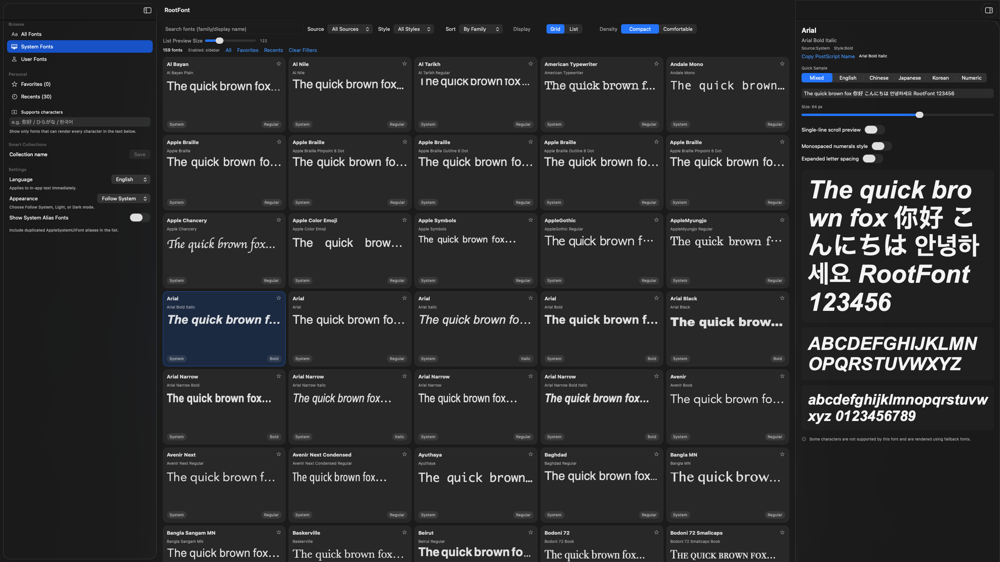
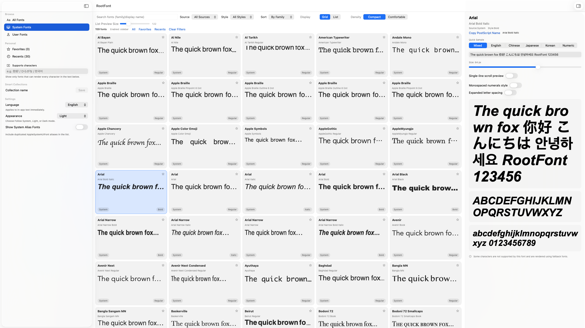

# RootFont


The native font manager for designers and programmers on macOS.

## Status

**Current build:** `v0.2.0-alpha (3)`  
**Platform:** macOS 14+  
**Bundle ID:** `com.rootfont.app`

RootFont is currently in active beta development.

## Screenshots (v0.2.0-alpha)

<p align="center">
  
  
</p>

## Features

- Browse installed fonts on macOS
- Search fonts by name
- Preview fonts with custom text and size
- Filter by source/style
- Favorites and recents support
- Localized UI (English, Simplified Chinese, Traditional Chinese, Japanese, Korean)

## Localization

- Supported languages: `en`, `zh-Hans`, `zh-Hant`, `ja`, `ko`
- Quick Sample presets include dedicated Japanese and Korean text
- When a selected font does not fully support current preview text, RootFont shows a fallback warning

## Quick Start

### Requirements

- macOS 14+
- Xcode 15+ (Swift toolchain included)

### Run

```bash
swift run RootFontApp
```

### Run Tests

```bash
swift test
```

## Contributing

Contributions are welcome. See [CONTRIBUTING.md](CONTRIBUTING.md) for details.

## License

RootFont is licensed under Apache License 2.0. See [LICENSE](LICENSE).

## Third-Party Notices

See [NOTICE](NOTICE) for third-party attribution requirements.

## Code of Conduct

This project follows the Contributor Covenant. See [CODE_OF_CONDUCT.md](CODE_OF_CONDUCT.md).